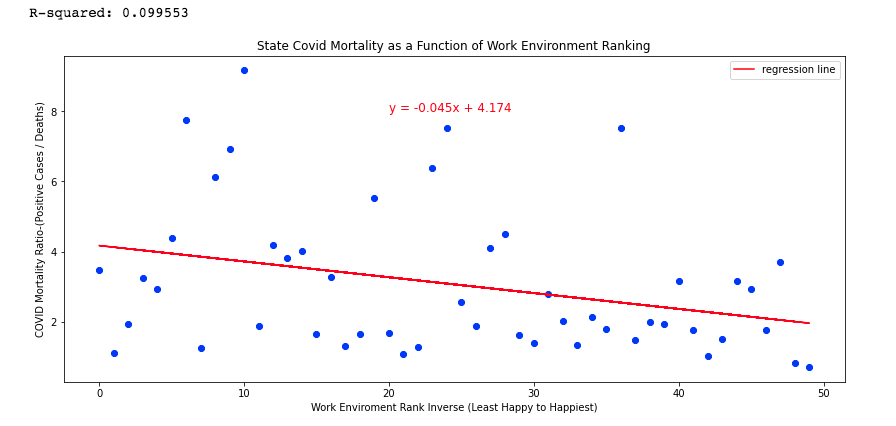
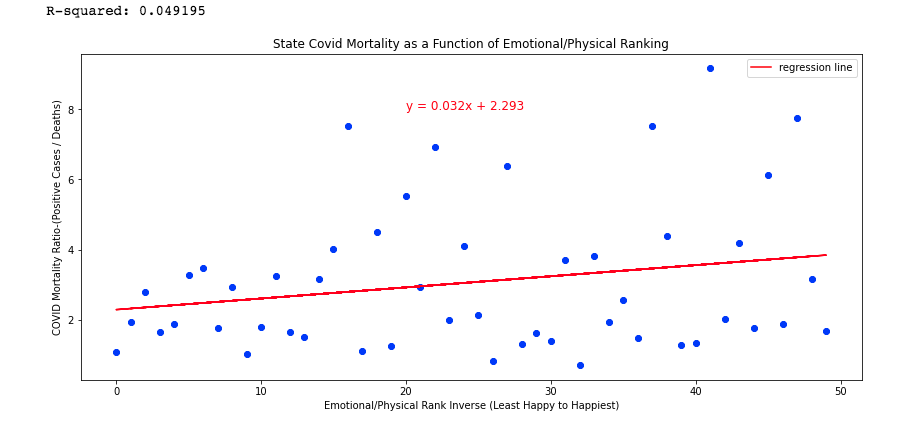
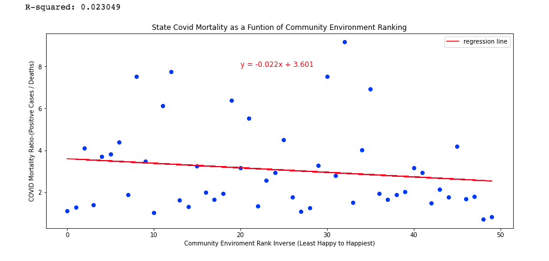
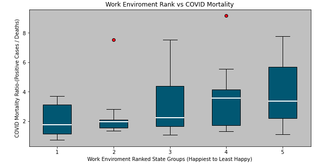
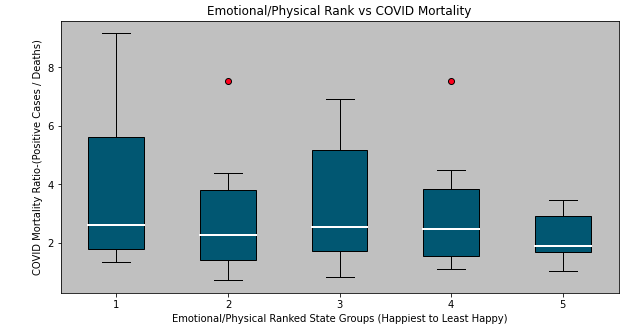
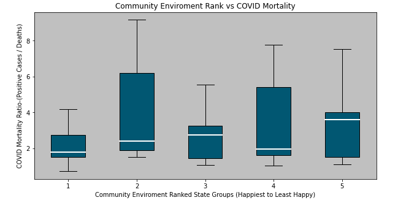
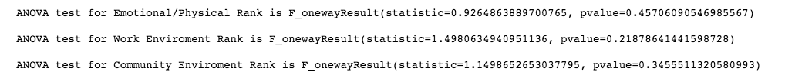

# Happiness – Driving Resilience for Covid-19

## Contributors:

*  Rhyce Erickson
*  Jason Alfred
*  Ali Anderson
*  Gabriel Figueroa

## Project Description:

With the COVID 19 pandemic surging in the US, we will attempt to quantify a correlation between a population’s measured sate of happiness and its resilience in managing COVID 19.   Using happiness data from 2020 that uses a weighted score of several criteria per state, we will overlay the mortality rate of COVID infections to test whether any or all of the criteria of measured happiness has a material impact on a population’s ability to recover and reduce the comorbidity associated with COVID.

## Research Questions to Answer:

*  Is the total measured happiness by state negatively correlated to the mortality rate of COVID-19?
*  Do the individual measures of happiness by state contribute more strongly to a negative correlation of the mortality rate?
	*  Emotional & Physical well being
	*  Work Environment
	*  Community & Environment

## Datasets:

*	State Happiness Index (2020)—Published by Wallethub.com
			https://worldpopulationreview.com/state-rankings/happiest-states
*	Current State Infection and mortality of COVID-19—Published by Johns Hopkins University
			https://documenter.getpostman.com/view/10808728/SzS8rjbc?version=latest

---
## In This Repository
* CovidAPI.ipynb -- Jupyter Notebook for the purpose of gathering data
	* Defines URLS for API calls
	* Executes API calls
	* Builds dataframe
	* Exports dataframe to CSV file

* functions.py -- Python file holding useful functions for data analysis
	* regressionLine - to draw regression lines on the scatter plots  
	* scatterDraw - to draw scatter plots from various data  
	* stateGrouper - to bin a varibale field, variable dataframe and number of bins  
	* boxDraw - to draw the box plots of various data  
	* runAnova - to perform statistical test

* FullDataset.ipynb -- Jupyter Notebook for the purpose of combining data from API calls with the state happiness rankings dataset (stateHappinessData.csv)
	* Merges state abbreviations (state_abbreviations.csv) with API data to enable secondary merge
	* Merge state happiness rankings dataset
	* Rename columns and drop columns
	* Export dataframe (MasterData200725.csv)
	* Add additional columns to dataframe to ensure happiness increases along x-axis
	* Export dataframe (MasterData200730.csv)

* Main.ipynb -- Jupyter Notebook for the purpose of analysis
	* Read final csv into dataframe
	* Scatterplot and Regression
	* Bin data with grouping function
	* Boxplot Visualization
	* Statistical Analysis

* StatePopulationData.ipynb -- Jupyter Notebook for the purpose of exploring data limitations
	*  In this project, we use the Case Fatality Rate. We wanted to look at the relationships using the Crude Mortality Rate. In an ideal world, we would use the Infection Fatality Rate

----

## Results
### Scatterplots With Regression
* Weak correlations as displayed by the flatness of the regression lines  
* Low R-squared values showing a lot of variance in the data

## Boxplot Visualization
Medians relatively close in value  
Outliers found with large variance in some groupings.

## Statistical Ananlysis
Hypothesis: A state's happiness ranking can be used to predict its resilience to COVID-19  
Null Hypothesis: A state's happiness ranking has no effect on its resilience to COVID-19

With p-values greater than 0.05, there is insufficient evidence to warrant rejection of the null hypothesis

<!-- Alexis's Contributions:  
	Researched Covid and Census APIs and helped create the code to gather the COVID Data from the API
	Explored the Crude Mortality Rate and used the census package to gather the data necessary to perform that analysis
	Assisted other team members in writing code for the project including code to work with the data and some functions
	Helped with code clean up & organizing our functions into a python file 
	Performed some other small tasks to improve the overall project including creating inverse columns in the master dataframe

Rhyce's Contributions:  
	Merged happiness and coronavirus datasets into our project's main dataset.
	Evaluated covid mortality as a function of community happiness and made scatter plot with regression line
	Drew conclusions on the project's finding from ANOVA test results
	Presented on statistical testing and conclusions and commented on dataset limitations

Jason's Contributions:  
I developed the following functions in a .py file for our data analysis and to import into our Jupyter notebook:  
* regressionLine - to draw regression lines on the scatter plots  
* scatterDraw - to draw scatter plots from various data  
* stateGrouper - to bin a varibale field, variable dataframe and number of bins  
* boxDraw - to draw the box plots of various data  

Wrote the API Call and dataframe for the COVID state data (CovidAPI.ipynb)  
epochConverter function - to convert Unix eopch date received in the COVID API data  
Assisted other team members in writing code for the project including code to work with the data and some functions -->